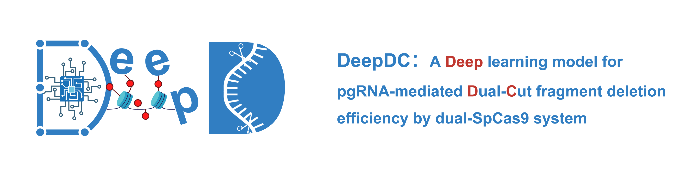
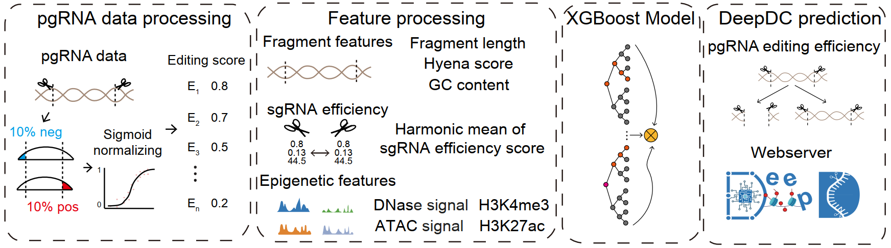

DeepDC, developed by Jialiang Huang's Lab at Xiamen University (XMU) and Teng Fei's Lab at Northeastern University (NEU), is a deep learning-based computational model designed to predict dual-editing efficiency in non-coding regions. It combines a HyenaDNA block and XGBoost to extract epigenomic features and sequence information from each paired sgRNA and predicts editing efficiency.



We also provide a [webserver](https://deepdc.huanglabxmu.com/) for user to design pgRNA and scoring.

# Run the Source Code

## Dependencies
```bash
Python version: 3.8.18  
Pytorch version: 2.4.1  
nvidia-tensorflow:1.15.5+nv23.03  
xgboost: 2.1.4
```

## Install
```bash
git clone https://github.com/xmuhuanglab/DeepDC.git  
conda env create -f cp38tf1.yaml  
conda activate cp38tf1
``` 

## Run the demo datasets
Here, we provide training and test demo input to showcase the DeepDC workflow:
| Chromosome | Start | End |
|:-----------:|:------:|:---:|
| chr11       | 5278000  | 5280000 |
| chr11       | 5280000  | 5282000 |
| chr11       | 5284000  | 5287000 |
| chr11       | 5288000  | 5292000 |
| chr11       | 5292000  | 5296000 |

### Download data
```bash
bash download_references.sh
```

### Preparation of input (Feature processing)
```bash
DataProcess.ipynb
```
This Jupyter notebook is used to collect information related to the target fragment.: 
1. pgRNA: Includes paired gRNA sequences and PAM information.
2. Epigenetic Features: Examples include DNase, ATAC, H3K4me3, and H3K27ac.
3. Deleted fragment length and GC Content: Distance between paired sgRNAs is limited to 50–200 bp.
4. gRNA Efficiency: Predicted by DeepCpf1, DeepCRISPR, CRISPRedit, and Ruleset2.
5. Fragment Score: Calculated using the HyenaDNA scoring system.

### For training and scoring
```bash
Training.ipynb Prediction.ipynb
```

### Batch design using scripts
```bash
python DeepDC_3_and_1_w.py --oc ./result/test1/ --region chr11:5290000-5292000 --genome hg38 --cellline K562
python DeepDC_3_and_1_b.py --oc ./result/test2/ --region data/test.bed --genome hg38 --cellline K562
```

# Contact us
If you have any further questions or encounter any issues, please feel free to contact us:
- [Liquan Lin: 21620241153548@stu.xmu.edu.cn](mailto:21620241153548@stu.xmu.edu.cn)
- [Shijie Luo: 24520230157443@xmu.edu.cn](mailto:24520230157443@xmu.edu.cn)
