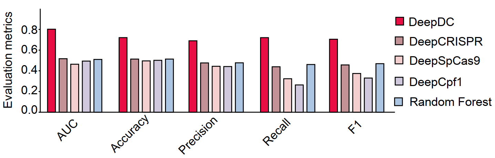
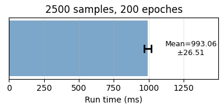

1. DeepDC Model
DeepDC is a deep learning-based computational model designed to predict the dual-cut fragment editing efficiency of dual-SpCas9 system. To construct DeepDC, we used XGBoost as the underlying architecture, and incorporated gRNA performance score and multiple features for the model building:

|Feature|Description|
|:---:|---|
|single guide RNA activiry score| Scores to evaluate single-end cutting efficiency. Generated by previous tools: DeepSpCas9, DeepCRISPR, Rule set 3 and CRISPRedict |
|Length|The length of target region|
|GC content| The GC content of target region|
|Hyena score| Scores to evaluate target region regulatory activity. Generated by a fine tuned HyenaDNA model|
|Epigenomic signal| Include DNase,ATAC,H3K27ac and H3K4me3 |

2. Public dataset source
We collected data from nine previously published studies:

|Reference|Cell line|DOI|
|:---:|:---:|---|
|Shiyou Zhu, Nature Biotechnology, 2016|Huh7.5OC, Hela|https://doi.org/10.1038/nbt.3715|
|Yarui Diao, Nature Methods, 2017|hESCs|https://doi.org/10.1038/nmeth.4264|
|Bo Ding, Science Advances , 2021|K562|https://doi.org/10.1126/sciadv.abi6020|
|Donghong Cai, Nature Aging, 2021|293T|https://doi.org/10.1038/s43587-021-00056-0|
|Ying Liu, Nucleic Acids Research, 2022|K562|https://doi.org/10.1093/nar/gkac197|
|Roberta Esposito, Cell Genomics, 2022|A549,H460|https://doi.org/10.1016/j.xgen.2022.100171|
|Hsiuyi V.Chen, AJHG, 2023|Jurkat T|https://doi.org/10.1016/j.ajhg.2023.03.008|
|Peiyao Wu, Nucleic Acids Research, 2024|K562|https://doi.org/10.1093/nar/gkae535|
|Xingjie Ren, Biorxiv, 2024|WTC11|https://doi.org/10.1101/2024.10.08.616922|

3. Data cleaning and preprocessing
Each study reported log-fold change (LFC) or an equivalent perturbation readout. We used MAGeCK to identify functional elements targeted by paired-guide RNAs, and retained only paired-guide RNAs located within these functional elements for downstream analysis. For each dual-guide perturbation, the two sgRNA target sites were mapped to the reference genome, and the intervening genomic sequence between the two cut sites was extracted. For each dataset, entries were ranked according to their perturbation effects, and the top and bottom 10% were selected as positive and negative samples, respectively. These public datasets, together with the 6-TG dual-SpCas9 screen dataset generated in this study, were used for subsequent model training and evaluation.

4. Model evaluation
A comparsion with four fine tuned previous models was done:

5. Computational costs
Model training was performed on an NVIDIA A30 GPU with 24 GB of memory for HyenaDNA fine-tuning, while the DeepDC model was trained on a server equipped with 48 Intel Xeon Silver 4310 CPUs running at 2.10 GHz. To assess runtime performance, a case study was conducted using 2,500 samples over 200 training epochs:  

